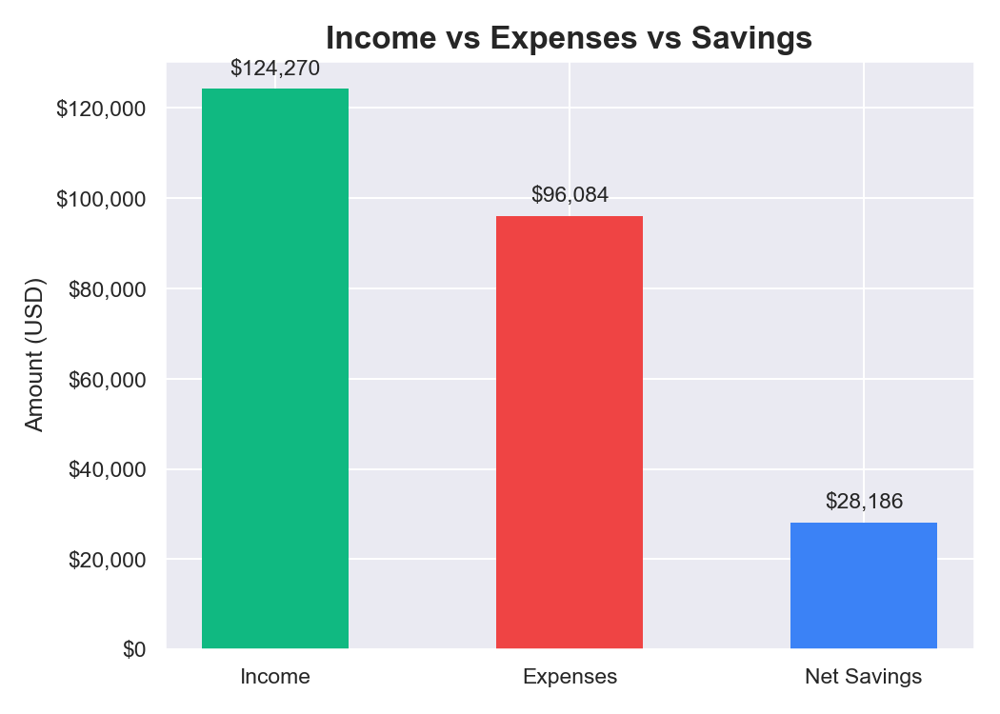
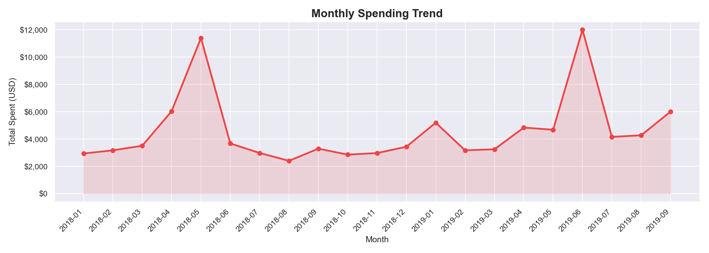
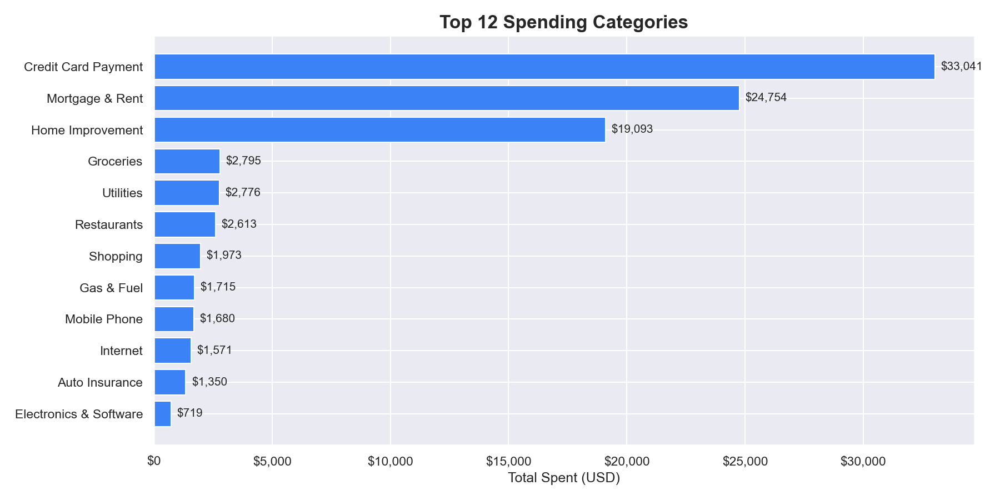
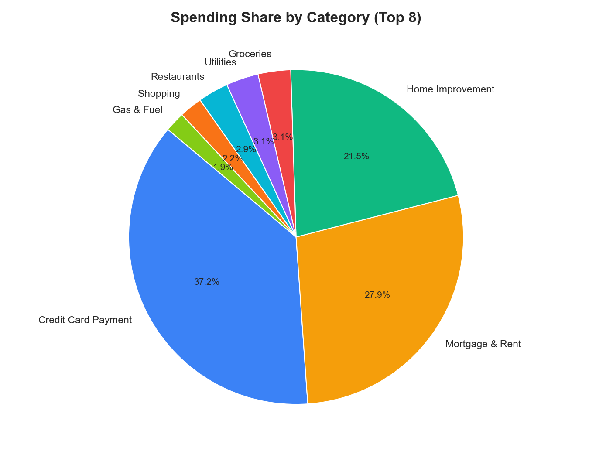
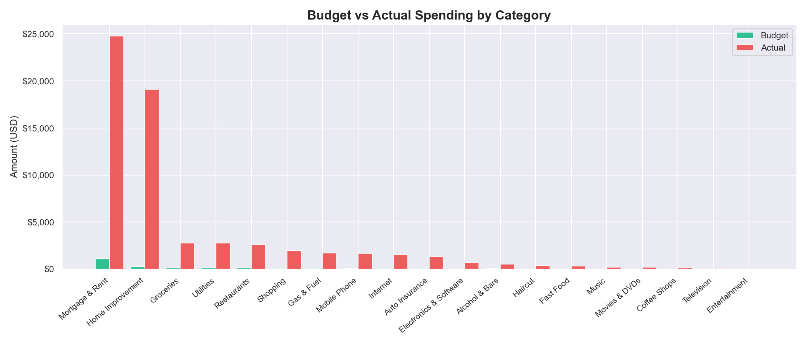
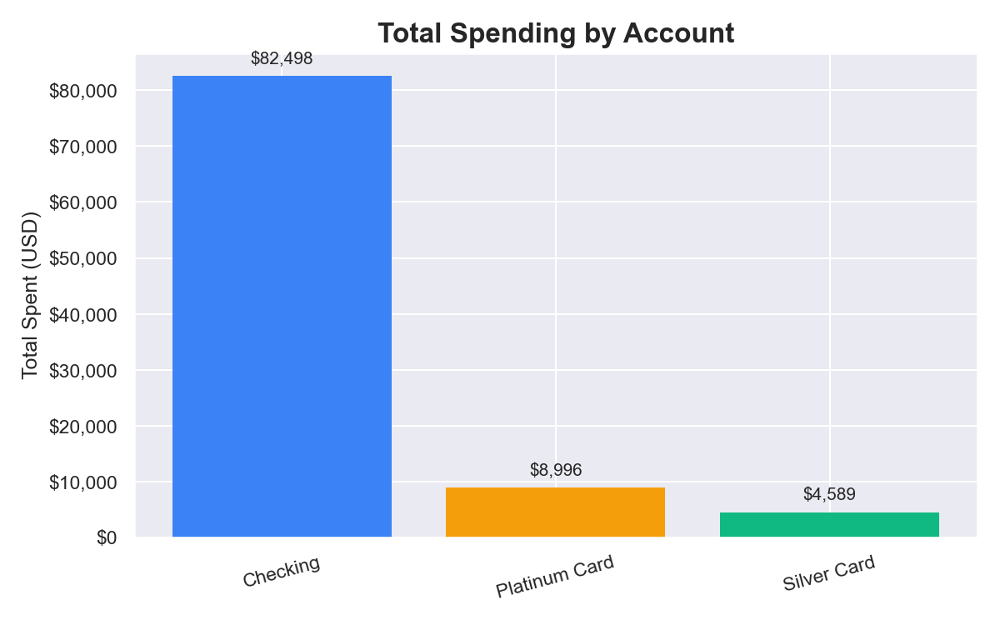

# SpendWise - Personal Finance & Spending Analysis

An exploratory data analysis of real personal finance transactions covering income, expenses, category breakdowns, monthly trends and budget performance.

---

## Table of Contents

- Project Overview
- Key Questions Answered
- Visualizations
- Technologies Used
- Project Structure
- How to Run
- Key Findings
- Author

---

## Project Overview

This project analyses 806 personal finance transactions recorded between **2018 and 2020**. The dataset includes transaction dates, descriptions, amounts, types (income/expense), categories and account names. A separate budget file is used to compare planned vs actual spending per category.

The analysis covers:
- Income vs expenses overview and savings rate
- Monthly spending trends
- Top spending categories
- Budget vs actual comparison
- Spending breakdown by account

---

## Key Questions Answered

- What is the overall savings rate?
- How does spending fluctuate month by month?
- Which categories consume the most money?
- Which categories exceed their budget?
- Which account is used the most for spending?

---

## Visualizations

### Income vs Expenses vs Savings


### Monthly Spending Trend


### Top 12 Spending Categories


### Spending Share by Category


### Budget vs Actual Spending


### Spending by Account


---

## Technologies Used

- **Language:** Python 3.12
- **Data Manipulation:** Pandas, NumPy
- **Visualization:** Matplotlib, Seaborn
- **Environment:** Jupyter Notebook

---

## Project Structure

```
SpendWise/
├── analysis.ipynb          <- Main analysis notebook
├── requirements.txt
├── LICENSE
├── README.md
├── data/
│   ├── personal_transactions.csv   <- Raw transactions (not tracked by git)
│   └── Budget.csv                  <- Monthly budget by category (not tracked)
└── outputs/
    ├── income_vs_expenses.png
    ├── monthly_spending.png
    ├── top_categories.png
    ├── spending_pie.png
    ├── budget_vs_actual.png
    └── spending_by_account.png
```

---

## How to Run

**1. Install dependencies:**
```bash
pip install -r requirements.txt
```

**2. Download the dataset:**

Get both CSV files from [Kaggle](https://www.kaggle.com/datasets/bukolafatunde/personal-finance) and place them inside the `data/` folder.

**3. Run the notebook:**
```bash
jupyter notebook analysis.ipynb
```

---

## Key Findings

- The overall savings rate across the period is positive, driven by consistent income
- **Mortgage & Rent** and **Restaurants** are the highest spending categories
- Several categories consistently exceed their monthly budget
- The **Platinum Card** account accounts for the majority of discretionary spending
- Spending spikes are visible in certain months, likely tied to seasonal expenses

---

## Author

**Berke Arda Turk**
Data Science & AI Enthusiast | Computer Science (B.ASc)
[Portfolio](https://berkeardaturk.com) · [LinkedIn](https://www.linkedin.com/in/berke-arda-turk/) · [GitHub](https://github.com/Mood07)
